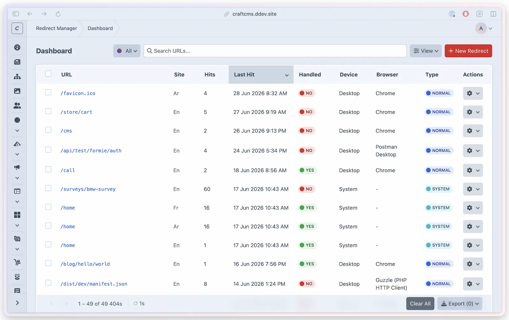

# Analytics @since(5.1.0)

Redirect Manager tracks every 404 that hits your site — whether it was handled by a redirect or went unmatched. The analytics dashboard gives you device breakdowns, geographic data, bot identification, and charts over time. Unhandled 404s can be turned into redirects with a single click.



## What Gets Tracked

Every 404 event records:

| Data | Description |
|------|-------------|
| URL | The path (and optionally query string) that returned 404 |
| Referrer | The referring URL from the HTTP `Referer` header, when the browser sent one — useful for finding which page links to the broken URL |
| Handled | Whether a matching redirect was found and fired |
| Source plugin | Which plugin reported the 404 (e.g., `redirect-manager`, `shortlink-manager`) |
| Device type | Desktop, mobile, or tablet (via Matomo DeviceDetector) |
| Browser | Browser name and version |
| OS | Operating system name |
| Detected language | Detected language code from request/browser fallback logic |
| Is bot | Whether the visitor was identified as a bot |
| Request type | Normal, bot, system agent, or security probe |
| Bot details | Bot name, category, and producer when identified |
| Agent | The identified bot or first-party system agent name shown in the dashboard table |
| Country | Visitor's country (when geo-detection is enabled) |
| City | Visitor's city (when geo-detection is enabled) |
| IP hash | Salted SHA256 hash — original IP is never stored |

Redirect Manager keeps two bounded views of this data. The dashboard list has
one cumulative summary per normalized URL and site, with the latest request
metadata. Charts, breakdowns, redirect analytics, geographic percentages, and
exports use daily dimensional aggregates, so earlier hits keep the handled
state, redirect, referrer, device, browser, OS, bot, and location that were
recorded for those requests.

Daily dimensional history starts when the schema 1.2.0 migration is applied.
The migration does not guess dimensions for older cumulative summaries, so
pre-upgrade hits remain visible in the URL summary but are not added to
historical charts, breakdowns, or exports.

## Enabling Analytics

Analytics is controlled by a master switch:

```php
// config/redirect-manager.php
'enableAnalytics' => true,
```

When disabled, no 404 data is recorded and the Analytics CP section is hidden. Device detection, geo detection, and IP hashing are all subject to this master switch.

## The Analytics Dashboard

Navigate to **Redirect Manager > Analytics** to see:

### 404 Trend

Charts showing hit volume over time, split by handled vs. unhandled. Dates are
grouped in Craft's configured time zone. Use the date range filter to zoom in
or compare periods.

### Most Common 404s

A table of the top 404 URLs ranked by hit count. Each row shows:
- The URL
- The referrer that linked to it, when one was sent (a sortable, hideable column)
- Total hit count
- Whether it was handled (redirected) or unhandled
- Request type: normal, system, bot, or security probe
- Agent name when a bot or first-party system agent was identified
- Last seen timestamp
- A "Create Redirect" action button for unhandled entries

Handled rows keep a link to the exact recorded redirect while that redirect is
still enabled and visible for the row's site. If that rule is no longer
available, Redirect Manager uses the current site-specific rule for the same
URL, then a global rule. A rule belonging only to another site is never used to
construct the link.

### Recent Unhandled 404s

The most recent unhandled 404 events in reverse chronological order. The table
includes request type and agent columns so system warmups, public bots, and
security probes can be separated from normal visitor traffic while you triage
new broken links.

### Device & Browser Breakdown

Bar charts showing the distribution of device types, browsers, and operating systems across all tracked 404s.

### Geographic Breakdown

Country and city distribution charts. Percentages use every qualifying hit in
the selected site and date filters, including locations beyond the displayed
top 15. They are only shown when `enableGeoDetection` is `true`.

### Request Type and Agents

The Traffic & Devices tab shows a request-type chart split into normal, system,
bot, and probe traffic. The same tab lists the top identified agents with their
type, category, producer, and hit total.

Bots are identified using Matomo DeviceDetector and are flagged in the data so
you can separate them from human traffic analysis.

First-party service agents, such as Cache Manager warmup requests, are tracked
as **System** traffic. They stay separate from human visitors, public crawler
bots, and security probes in both the analytics charts and the dashboard
request-type filter.

Analytics exports include the same enriched request metadata, including referrer,
device brand/model, browser version and engine, OS version, detected language, user
agent, traffic type, system-agent flag, bot flag, bot category, and bot
producer.

## Auto-Refresh

The dashboard can refresh automatically at a configurable interval:

```php
'refreshIntervalSecs' => 30, // 15, 30, 60, or 120 seconds; null = disabled
```

When a user interacts with the page (hover, click, scroll), auto-refresh pauses to avoid disrupting their workflow. It resumes when interaction stops.

## Creating Redirects from 404s

The most common action in the analytics dashboard is fixing unhandled 404s. Each unhandled URL in the "Most Common 404s" table has a **Create Redirect** button. Clicking it opens the new redirect form pre-filled with the 404 URL as the source — just add a destination and save.

## Device Detection

Device detection is powered by [Matomo DeviceDetector](https://github.com/matomo-org/device-detector) @since(5.14.0). It identifies device type, browser name, browser version, OS, bot status, bot category, bot producer, and first-party system-agent traffic from the user-agent string and browser Client Hints when available.

Detection results are cached to avoid re-parsing the same user-agent repeatedly:

```php
'cacheDeviceDetection'          => true,
'deviceDetectionCacheDuration'  => 3600, // seconds
```

## Geographic Detection

Geographic detection is disabled by default. Enable it and configure a provider:

```php
'enableGeoDetection' => true,
'geoProvider'        => 'ip-api.com',  // 'ip-api.com', 'ipapi.co', 'ipinfo.io'
'geoApiKey'          => \craft\helpers\App::env('REDIRECT_MANAGER_GEO_API_KEY'),
```

The `geoApiKey` enables HTTPS for `ip-api.com` and unlocks higher rate limits on all providers.

### Local Development Override

Private IP addresses (127.0.0.1, 192.168.x.x, 10.x.x.x) cannot be geolocated automatically. In development, set both defaults to record a local test location:

```php
// config/redirect-manager.php
'defaultCountry' => 'US',
'defaultCity'    => 'New York',
```

Alternatively, use environment variables:

```dotenv title=".env"
# .env
REDIRECT_MANAGER_DEFAULT_COUNTRY=US
REDIRECT_MANAGER_DEFAULT_CITY=New York
```

These settings only affect private/local IPs. In production, real visitor IPs use actual geolocation. If either default is missing or unsupported, private/local IP geo fields stay empty instead of using a fallback location.

**Supported default locations include:** US (New York, Los Angeles, Chicago, San Francisco), GB (London, Manchester), DE (Berlin, Munich), FR (Paris), CA (Toronto, Vancouver), AU (Sydney, Melbourne), JP (Tokyo), SG (Singapore), IN (Mumbai, Delhi), AE (Dubai, Abu Dhabi), and SA (Riyadh, Jeddah).

## Privacy

Redirect Manager is designed to be GDPR-friendly:

- **IP hashing**: IPs are never stored. A salted SHA256 hash is stored instead. Original IPs are unrecoverable.
- **IP hash salt**: Must be generated explicitly with `php craft redirect-manager/security/generate-salt`. Without a salt, an error banner appears in settings.
- **Subnet masking**: Enable `anonymizeIpAddress` to zero out the last IP octet before hashing (e.g., `192.168.1.123` becomes `192.168.1.0`).
- **Geo first, hash after**: When geo-detection is enabled, the country/city is extracted from the real IP, then the original IP is discarded before hashing.

```php
'anonymizeIpAddress' => false, // set true for extra anonymization
'ipHashSalt'         => \craft\helpers\App::env('REDIRECT_MANAGER_IP_SALT'),
```

> [!WARNING]
> Changing the IP hash salt in production will break unique visitor deduplication. All historical hashes will no longer match new hashes from the same IPs.

## Retention and cleanup

Analytics recording stays on the request path so counts and metadata are available immediately. Retention and limit maintenance run separately in a scheduled queue job:

```php
'analyticsRetention' => 30,   // Delete records older than 30 days; 0 disables age cleanup
'analyticsLimit'     => 1000, // Target maximum after scheduled limit cleanup
'autoTrimAnalytics'  => true, // Enforce analyticsLimit during scheduled cleanup
```

Setting `analyticsRetention` to `0` does not disable limit cleanup when `autoTrimAnalytics` is `true`. Likewise, setting `autoTrimAnalytics` to `false` does not disable age-based deletion when retention is greater than `0`.

The limit is a scheduled convergence target, not a hard request-time cap. New handled and unhandled events are recorded immediately, so a temporary overflow can exist until the next cleanup run. The job removes the oldest, lowest-hit URL summaries until the table reaches `analyticsLimit`, together with the daily history owned by each removed summary. Age retention and manual clear/delete operations also remove the matching summary and dimensional history together.

Keep Craft's queue processing active for automatic cleanup:

```bash title="PHP"
php craft queue/run
```

```bash title="DDEV"
ddev craft queue/run
```

Manual analytics clearing remains available from **Redirect Manager > Analytics** and the Redirect Manager Craft utility when you need to remove data before the scheduled job runs.

## Exporting Analytics

Export 404 analytics as CSV from **Redirect Manager > Analytics > Export CSV**. Each row represents one daily dimensional aggregate and includes every tracked field — URL, referrer, site, hit count, handled status, the full request-type, traffic-type, device, browser, OS, and bot metadata, geographic country and city, the salted IP hash, user agent, and timestamps.

The `redirectManager:exportAnalytics` permission is required to access the export button.

## Analytics Services

The `AnalyticsService` @since(5.7.0) is a facade that delegates to five focused sub-services:

| Sub-service | Responsibility |
|-------------|----------------|
| `AnalyticsQueryService` | Querying and filtering analytics records |
| `AnalyticsTrackingService` | Recording 404 events |
| `AnalyticsBreakdownService` | Computing device, browser, OS, geo breakdowns |
| `AnalyticsExportService` | Generating CSV export data |
| `AnalyticsMaintenanceService` | Cleanup eligibility, execution, and recurring scheduling |
