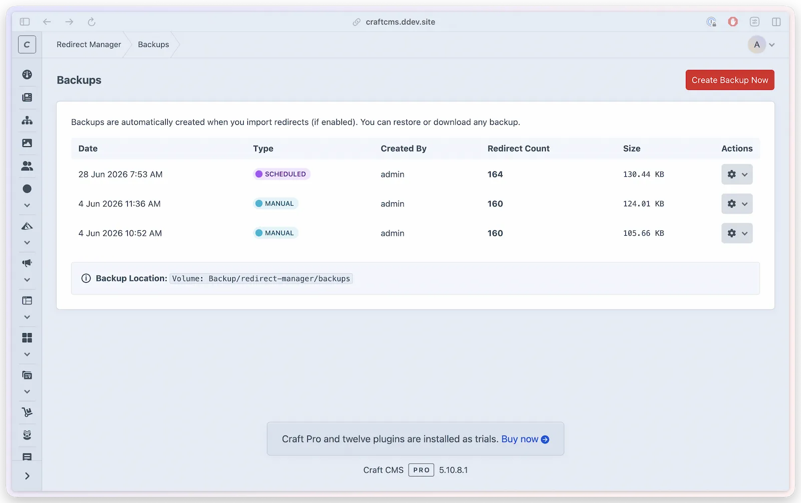

# Backups @since(5.23.0)

Redirect Manager can automatically back up your redirect library before imports and on a scheduled basis. Backups are stored locally or in a Craft asset volume, and can be restored from the CP or CLI.



## How Backups Work

A backup is a snapshot of your redirect library at a point in time, saved as a file in a configured storage location. Backups are created:

- **Automatically before CSV imports** (when `backupOnImport` is `true`)
- **On a schedule** (daily, weekly, or monthly, when `backupSchedule` is not `disabled`)
- **Manually** from the Backups CP section or via console command

## Configuration

```php
// config/redirect-manager.php
'backupEnabled'       => true,
'backupOnImport'      => true,
'backupSchedule'      => 'disabled', // 'disabled', 'daily', 'weekly', 'monthly'
'backupRetentionDays' => 30,       // 0 = keep forever, max 365
'backupPath'          => '@storage/redirect-manager/backups',
'backupVolumeUid'     => null,     // Asset volume UID (optional)
```

### Storage Location

By default, backups are stored on the local filesystem at `@storage/redirect-manager/backups`. This path supports Craft's `@storage` and `@root` aliases plus `$VARIABLE` environment variable substitution. Environment variables must resolve inside Craft's storage directory or a project-root subfolder.

To store backups in a Craft asset volume instead, set `backupVolumeUid` to the UID of the target volume. You can find volume UIDs in **Settings > Assets**. Local volumes cannot resolve inside `@webroot`, so public upload volumes are rejected for backup storage. Remote volumes such as Amazon S3 are allowed; configure bucket/object access policies in the storage provider so backups are private.

When both `backupPath` and `backupVolumeUid` are set, the volume takes precedence.

Redirect Manager uses the selected Craft volume directly, including any subpath configured on that volume. New backups are therefore stored under the volume's configured subpath and then `redirect-manager/backups`. The same location is used for listing, size calculation, downloads, restores, deletion, and retention.

Backups created by earlier versions may exist at `redirect-manager/backups` at the filesystem root, outside a configured volume subpath. Redirect Manager checks that exact historical location so those backups remain manageable; it does not scan other locations or move files automatically. The Backups list identifies the location used for each entry. If the same backup name exists in both places, the backup beneath the configured volume subpath is authoritative. Deleting or retaining that canonical backup does not delete the historical duplicate during the same operation.

An explicitly configured volume is authoritative. If its UID is missing, its filesystem cannot be resolved, or the requested filesystem operation is unavailable, Redirect Manager blocks the operation and reports that the configured backup volume is unavailable. It does not silently write the backup to `backupPath` or `@storage`. Restore service by restoring access to the same volume, or change the effective `backupVolumeUid` in the CP or `config/redirect-manager.php`.

### Craft Cloud storage

Craft Cloud's application filesystem is ephemeral, so a custom path is not durable backup storage there. A Craft volume backed by a local filesystem has the same limitation, even when its path is outside `@webroot`. For persistent backups on Craft Cloud, select a volume that uses Craft Cloud's **Cloud** filesystem type. See Craft's [local filesystem migration guidance](https://craftcms.com/docs/cloud/assets.html#local).

On an ephemeral host, the Backup settings page shows a colored warning when the effective configuration uses a custom path or a local-filesystem volume. Config-file overrides are applied first, so the warning reflects the value the plugin will actually use rather than a different stored CP value. A successfully resolved non-local filesystem suppresses only this local-storage warning; it does not certify that a third-party filesystem is fully compatible with Craft Cloud.

The local-storage warning is informational. It does not change the selected setting or any backup, restore, download, retention, or queue behavior. A missing, validation-invalid, or unresolved configured volume instead shows a separate unavailable-volume error on both durable and ephemeral hosts. That state is neither classified as local fallback storage nor described as durable.

### Scheduled Backups

| Value | Behavior |
|-------|----------|
| `disabled` | No automatic schedule; backups only run on demand or before imports |
| `daily` | Backup runs once per day |
| `weekly` | Backup runs once per week |
| `monthly` | Backup runs once per month |

Scheduled backups normally run through Craft's queue. Redirect Manager keeps one delayed scheduled-backup chain for the next run. Each eligible occurrence schedules its successor even when the current storage attempt fails, allowing the same configured volume to recover automatically on a later run. On queue transports with a bounded delay, the plugin relays the wait through intermediate queue handoffs; those handoffs do not create backups. Local queue transports retain the complete native delay. Run a queue worker with `queue/listen` or a cron-driven `queue/run` so scheduled backups fire on time.

Changing `backupSchedule` in `config/redirect-manager.php` takes effect without resaving the Control Panel settings. On the next plugin bootstrap, Redirect Manager replaces the pending occurrence for the old cadence with one scheduled for the new daily, weekly, or monthly timing. Repeated requests with the same effective cadence keep the existing occurrence instead of continually requeuing it.

The queued job description shows when that specific queued row is due to run. Craft stores that description when the row is queued, so date/time format changes apply to newly queued rows. Existing delayed rows keep their old label until they run or are requeued. Queue labels stay compact: numeric months render numerically, while short and long month settings both render as short month names.

### Retention

Set `backupRetentionDays` to control how long backups are kept:

```php
'backupRetentionDays' => 30, // delete backups older than 30 days
```

Set to `0` to keep all backups indefinitely. The maximum value is `365` days. Cleanup runs automatically when a new backup is created.

## Managing Backups in the CP

Navigate to **Redirect Manager > Backups** to:

- View a list of existing backups with timestamps, storage locations, and file sizes
- Create a manual backup
- Download a backup as a ZIP file
- Restore redirects from a backup
- Delete individual backups

Downloaded ZIP files are portable archives. To use one on another install without an upload flow, extract the ZIP and place its files in the expected backup folder structure under that install's configured backup storage.

Each download uses its own temporary ZIP. Redirect Manager removes that exact archive after the response completes and also registers an interruption safeguard, so a downloaded archive does not outlive the backup-retention lifecycle as a separate temporary copy.

If the redirect library is empty, manual, scheduled, and console backup creation completes as a successful no-op. Redirect Manager reports that there was nothing to back up and does not create an empty artifact.

## Restoring from a Backup

To restore your redirect library to a previous state:

1. Go to **Redirect Manager > Backups**
2. Find the backup you want to restore
3. Click **Restore**
4. Confirm the action — this will replace your current redirects with the backup contents

> [!WARNING]
> Restoring a backup replaces your current redirect library. Redirect Manager first creates a complete safety backup when current redirects exist. If that safety backup cannot be completed, restore stops before any current redirect is deleted or replaced.

Restore requires an intact backup folder with `metadata.json`, `redirects.json`, and a valid SHA-256 checksum in the metadata. Backups with missing metadata, missing checksum data, or modified JSON contents are rejected before redirects are replaced.

## Console Commands

### Create a Backup

```bash title="PHP"
php craft redirect-manager/backup/create
```

```bash title="DDEV"
ddev craft redirect-manager/backup/create
```

Options:

| Option | Description |
|--------|-------------|
| `--reason=<text>` | Optional label for the backup (e.g., `--reason="before-migration"`) |
| `--clean` | Run retention cleanup after creating the backup |

### Run Scheduled Backup

Checks whether a backup is due based on `backupSchedule` and creates one if needed. This is useful for manual checks and legacy cron setups; normal automatic scheduling uses Craft's queue.

```bash title="PHP"
php craft redirect-manager/backup/scheduled
```

```bash title="DDEV"
ddev craft redirect-manager/backup/scheduled
```

If you prefer a direct cron setup instead of the recurring queue row, run the command on your server schedule:

```cron
0 2 * * * /path/to/craft redirect-manager/backup/scheduled
```

### List Backups

```bash title="PHP"
php craft redirect-manager/backup/list
```

```bash title="DDEV"
ddev craft redirect-manager/backup/list
```

### Clean Up Old Backups

Removes backups that exceed the retention period:

```bash title="PHP"
php craft redirect-manager/backup/clean
```

```bash title="DDEV"
ddev craft redirect-manager/backup/clean
```

## Permissions

| Action | Permission Required |
|--------|---------------------|
| Access Backups section | `redirectManager:manageBackups` |
| Create manual backup | `redirectManager:createBackups` |
| Download backup files | `redirectManager:downloadBackups` |
| Restore from a backup | `redirectManager:restoreBackups` |
| Delete backup files | `redirectManager:deleteBackups` |

See [Permissions](../developers/permissions.md) for the full permission hierarchy.
