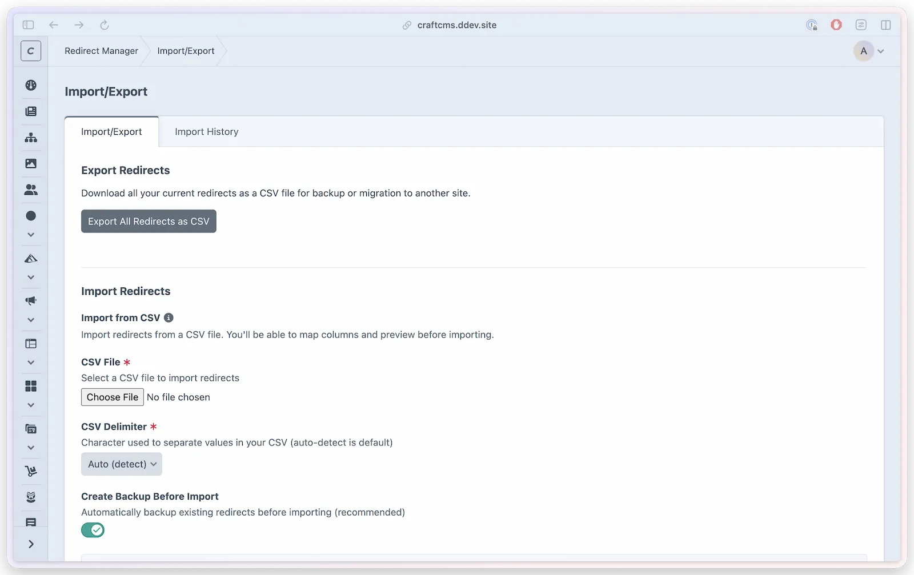
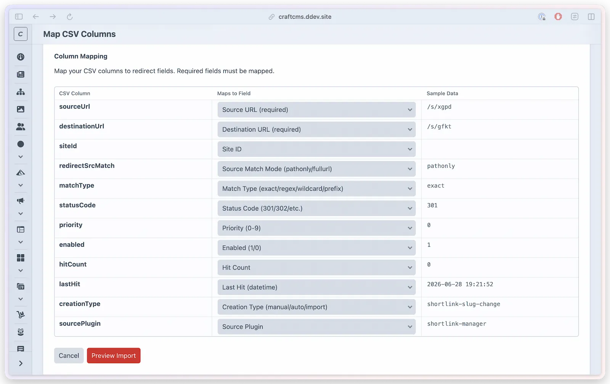
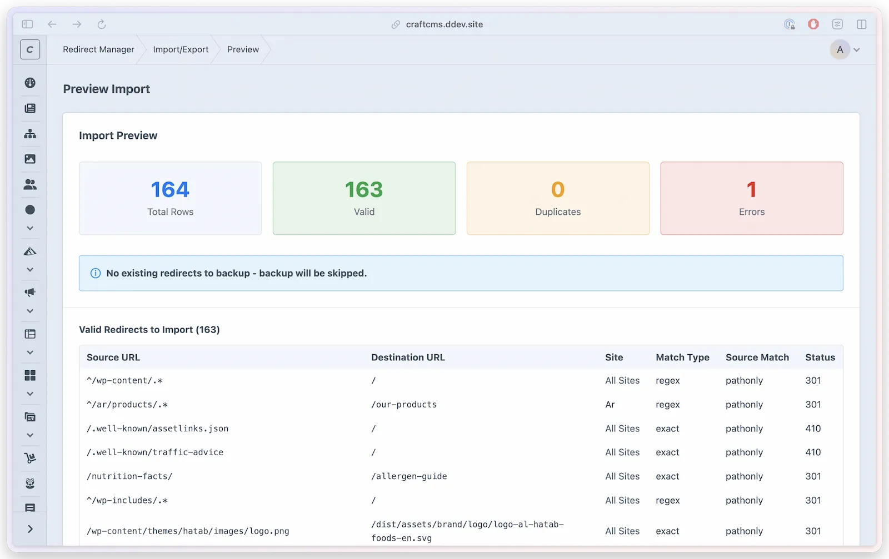

# Import and export

Redirect Manager supports bulk redirect management through CSV import and export. Import hundreds of redirects at once with a guided column-mapping workflow. Export your full redirect library for backup or migration.



## Import redirects

Navigate to **Redirect Manager > Import/Export** to start an import.

### Import workflow

1. **Upload CSV** — Select and upload your CSV file. Maximum 4000 rows per import. For larger datasets, split into multiple files.
2. **Map Columns** — The plugin reads your CSV headers and presents a mapping screen. Match each CSV column to the corresponding redirect field.
3. **Preview** — Review a sample of parsed rows before committing. Any validation issues are flagged here.
4. **Import** — Confirm to run the import. The plugin processes each row and reports success/failure counts.

On the **Map CSV Columns** step, match each CSV column to a Redirect Manager field and use the sample data column to catch shifted or empty values before previewing the import:



The **Preview Import** step summarizes total, valid, duplicate, and error rows, then lists the redirects that will be imported before anything is written:



### CSV format

Your CSV file must have a header row. Column names do not need to match exactly — you map them in step 2.

Required fields for each redirect:

| Field | Description | Example |
|-------|-------------|---------|
| Source URL | The incoming URL pattern | `/old-page` |
| Destination URL | Where to redirect | `/new-page` |

Optional fields (defaults are used when omitted):

| Field | Default | Description |
|-------|---------|-------------|
| Match Type | `exact` | `exact`, `regex`, `wildcard`, or `prefix` (the mapper also accepts the aliases `exact match`, `regex match`, `regexp`, `wildcard match`, and `prefix match`) |
| Source Match Mode | `pathonly` | `pathonly` or `fullurl` (the aliases `path only`, `path`, `full url`, `full`, and `url` are also accepted) |
| Status Code | `301` | `301`, `302`, `303`, `307`, `308`, `410` |
| Priority | `0` | `0`–`9` (lower = higher priority) |
| Enabled | `true` | `true` or `false` |
| Site ID | `null` | Numeric site ID, or blank for all sites |

> [!NOTE]
> Rows are imported only for sites you can edit. If a row names a **Site ID** that your account has no editing permission for, that row is skipped and counted toward the failed total in the import summary. Rows left blank (all sites) always import.

Path-only Exact and Prefix rows may use either a path or a complete HTTP(S) source. A complete URL is previewed and imported as its path only; its host, query string, and fragment are discarded. Regex and Wildcard source patterns remain unchanged. This is the same normalization used by the redirect editor and public redirect service.

Canonical values and supported aliases are compared without regard to letter case. A mapped field that is blank uses its documented default, just as an omitted field does. Any other nonblank Match Type or Source Match Mode is rejected instead of being silently rewritten. Priority must be a whole number from `0` through `9`; negative, larger, and non-numeric values are rejected in preview.

Duplicate identity is the normalized source plus its site scope. Match Type and Source Match Mode labels do not create a second identity for the same normalized source. Global and site-specific rows remain separate, while equivalent path-only full URLs, paths, and Exact/Prefix case variants collide. Preview checks both existing redirects and earlier accepted rows in the same CSV, so the final import uses the same identity the preview reported.

### Portable import ownership

A CSV is a portable data format, not a same-install lifecycle backup. Every imported CSV row becomes a manual redirect owned by Redirect Manager. The mapper does not offer creation type, source plugin, or element ID fields, and those columns are ignored if a CSV includes them. This prevents a portable row from claiming entry-change, Shortlink, Smartlink, or another integration's ownership without the original element lifecycle.

JSON backups created by Redirect Manager are different: restoring one on the same installation may retain a valid creation type, source plugin, and element association. Restore still recalculates the canonical normalized source and site identity before writing the rows.

### Row validation

Each row is validated before import; problems are flagged in the **Preview** errors bucket and those rows are skipped. A row is rejected when:

- **Source or Destination URL is missing or malformed** — a bare scheme (`https://` with no host), an email-looking value, a protocol-relative `//host`, or a bare capture such as `$1` is rejected. A destination may be a path, a full `http(s)://` URL with a host, or a contact/application link (`mailto:`, `tel:`, `whatsapp:`, `sms:`, `fax:`, `skype://`, `slack:`, `msteams:`).
- **A capture controls the destination trust boundary** — captures may refine a relative path, a fixed-host HTTP(S) path/query/fragment, or the payload of a contact/application link. They cannot supply the scheme or control an HTTP(S) hostname, user information, or port. For example, `https://example.com/$1?from=$2` is valid; `$1`, `https://$1/path`, and `https://example.com:$1/path` are not.
- **A capture reference exceeds the match type** — e.g. `$1` under `exact`, or `$2` when the source has only one `*` / one capturing group. See [Match Types](redirects.md#match-types).
- **Match type, source match mode, priority, or status code is invalid**, the row duplicates an existing redirect (or an earlier row in the same CSV), or the source and destination are identical (a loop).

Validation prevents intrinsically unsafe new templates from being imported. Redirect Manager still checks substituted destinations at runtime so older published rows and records created through integrations cannot emit an unsafe redirect. An unsafe matching rule is skipped and the next eligible safe rule is considered.

### Import limits

The maximum is **4000 rows per import**. This limit ensures reliable operation across all hosting environments. For larger redirect libraries, split your CSV into batches of 4000 or fewer rows.

### Backup before import

By default, Redirect Manager creates a backup of your current redirects before processing an import. This ensures you can restore if something goes wrong.

```php
// config/redirect-manager.php
'backupOnImport' => true,
```

Disable this setting to skip the pre-import backup (not recommended for large imports).

### Import history @since(5.23.0)

Every import is logged in the Import History tab. Each entry shows:

- Import date and time
- Number of rows imported
- Success and error counts
- The filename used

This log is useful for auditing changes and understanding the state of your redirect library over time.

The `redirectManager:manageImportExport` permission is required to access the history tab. The `redirectManager:clearImportHistory` permission is required to delete history logs.

### Clear import history

Import history can be cleared from the Import History tab. This permanently deletes the log entries but does not affect the redirects themselves.

## Export redirects

To export your full redirect list as CSV:

1. Go to **Redirect Manager > Import/Export**
2. Click **Export Redirects**

The export includes source URL, destination URL, site ID, source match mode, match type, status code, priority, enabled status, hit count, last-hit time, creation type, and source plugin. Creation type and source plugin are useful export context, but a later CSV import deliberately ignores those ownership fields and creates manual Redirect Manager-owned rows as described above.

The `redirectManager:exportRedirects` permission is required.

## Permissions summary

| Action | Permission Required |
|--------|---------------------|
| Access Import/Export section | `redirectManager:manageImportExport` |
| Import redirects from CSV | `redirectManager:importRedirects` |
| Export redirects to CSV | `redirectManager:exportRedirects` |
| Clear import history | `redirectManager:clearImportHistory` |

See [Permissions](../developers/permissions.md) for the full permission hierarchy.
