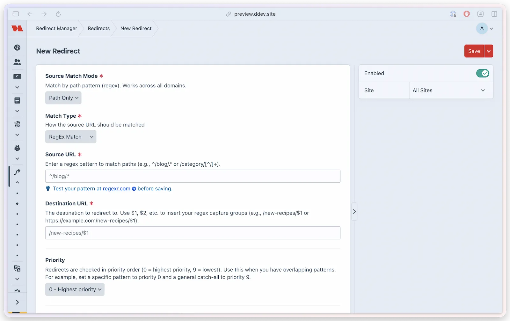

# Redirects

Redirect Manager matches incoming 404 requests against a library of redirect rules and issues the appropriate HTTP response. Rules support four match types, priority ordering, redirect status codes, `410 Gone`, and multi-site scoping.



## Create redirects

### In the Control Panel

1. Go to **Redirect Manager > Redirects**
2. Click **New Redirect**
3. Fill in the redirect fields (see below)
4. Save

### Programmatically

```php
use lindemannrock\redirectmanager\RedirectManager;

RedirectManager::$plugin->redirects->createRedirect([
    'sourceUrl'      => '/old-page',
    'destinationUrl' => '/new-page',
    'matchType'      => 'exact',
    'statusCode'     => 301,
    'enabled'        => true,
    'priority'       => 0,
    'siteId'         => null, // null = all sites
]);
```

## Match types

Four match types give you precise control over how source URLs are compared.

| Match Type | Behavior | Example Pattern | Matches |
|------------|----------|-----------------|---------|
| `exact` | Case-insensitive exact match | `/old-page` | `/old-page`, `/OLD-PAGE` |
| `wildcard` | `*` wildcards match any characters | `/blog/*` | `/blog/post-1`, `/blog/category/news` |
| `prefix` | URL starts with the pattern | `/old-` | `/old-page`, `/old-blog`, `/old-anything` |
| `regex` | Full regular expression | `^/blog/(\d+)/(.*)$` | `/blog/123/my-post` |

Matching is case-insensitive for every match type, on every database engine. `exact` and `prefix` rules also store their matching URL lowercased, so duplicate detection and uniqueness behave case-insensitively everywhere (query-string values included). Pattern rules (`regex`/`wildcard`) keep engine-native uniqueness: PostgreSQL permits deliberate case-variant functional duplicates (harmless — matching is case-insensitive either way), while MySQL additionally rejects some legitimately distinct escape-differing patterns (`\W` vs `\w`) as a known collation quirk. Neither affects which redirects fire.

### Exact match

The simplest and most performant match type. Comparison is case-insensitive.

```
Pattern:  /old-page
Matches:  /old-page
          /OLD-PAGE
No match: /old-page/subpage
          /old-page-2
```

### Wildcard match

Replaces `*` with "any characters". Useful for redirecting entire URL subtrees. Each `*` is also a capture group — use `$1`, `$2` (etc.) in the destination to insert what each `*` matched, in order (e.g. `/blog/*` → `/news/$1`).

```
Pattern:  /blog/*
Matches:  /blog/post-1
          /blog/category/news
          /blog/2024/01/my-post
```

### Prefix match

Matches any URL that starts with the pattern string. The portion of the URL after the prefix is available as `$1` in the destination (e.g. `/old-` → `/new-/$1`).

```
Pattern:  /old-
Matches:  /old-page
          /old-blog
          /old-anything
No match: /new-old-page (does not start with /old-)
```

### Regex match with capture groups

Full regular expression support, including named and positional capture groups. Use `$1`, `$2` (etc.) in the destination URL to substitute captured values.

```
Pattern:     ^/blog/(\d+)/(.*)$
Destination: /article/$1/$2

Matches and redirects:
  /blog/123/my-post  →  /article/123/my-post
  /blog/456/news     →  /article/456/news
```

Capture group substitution is processed by `MatchingService::applyCaptures()` @since(5.10.0).

> [!NOTE]
> Capture substitution works for **Wildcard**, **Prefix**, and **Regex** matches. Exact Match supports `$0` for the full matched URL but has no numbered groups such as `$1`. A destination that references more captures than the match type can produce — `$1` under Exact Match, or `$2` when the source has only one `*` / one capturing group — is rejected when you save or import.

> [!NOTE]
> Regex patterns are matched against the full path (or full URL, depending on [Source Match Mode](#source-match-mode)). Do not wrap patterns in delimiters.

## Destination URL

The destination is where matched requests are sent. Valid destinations:

- A relative path — `/new-page` (not protocol-relative `//host`)
- A full `http(s)://` URL **with a host** — `https://example.com/new-page`
- A contact/app link — `mailto:`, `tel:`, `whatsapp:`, `sms:`, `fax:`, `skype://`, `slack:`, `msteams:`
- Any of those destination types with captures in their safe portion — `/new/$1`, `https://example.com/$1?from=$2`, or `mailto:$1@example.com`

Bare schemes (`https://` with no host), protocol-relative URLs (`//host`), executable schemes (`javascript:`, `data:`, …), and a bare capture such as `$1` are rejected. The same rule applies to the Control Panel form and CSV import.

Captures refine a destination; they do not choose where it is trusted to go. A relative template remains relative after substitution. An `http://` or `https://` template keeps the scheme and authority you entered, so captures can appear in its path, query, or fragment but not in its scheme, hostname, user information, or port. Contact and application templates likewise keep their entered scheme.

Redirect Manager also applies this rule when a redirect runs. This protects older rows and records written by integrations that may have bypassed current validation. If the first matching rule resolves outside its template's trust boundary, creates a redirect cycle, or exhausts the ten-hop chain limit, Redirect Manager skips it and evaluates the next matching rule. If no matching rule reaches a safe endpoint, the request remains unhandled. Only the eventual safe winner receives a hit, handled analytics, or a positive cache entry.

## Priority

When multiple redirect rules could match the same URL, Redirect Manager first ranks a rule assigned to the requested site ahead of a global rule. Within each site rank, priority determines which one is evaluated first; lower numbers come first, with the older rule ID breaking a tie.

| Priority | Description | Recommended Use |
|----------|-------------|-----------------|
| 0 | Highest | Specific patterns, exceptions |
| 1–4 | High | Important or frequent redirects |
| 5 | Normal | Standard redirects |
| 6–8 | Low | Broad patterns |
| 9 | Lowest | Catch-all patterns |

New redirects default to priority `0` (highest) — raise the number for broader, fall-through patterns that should only match when nothing more specific does.

**Example:** You have `/blog/featured-post` set to priority 0 and `/blog/*` set to priority 9. Visitors to `/blog/featured-post` hit the exact rule; all other `/blog/` paths fall through to the wildcard.

Priority is evaluated among eligible safe rules in the same site rank. A matching rule whose capture substitution would change its destination trust boundary, whose chain cycles, or whose chain exceeds the depth limit is skipped rather than blocking the next safe rule.

## Status codes

| Code | Name | Description |
|------|------|-------------|
| `301` | Moved Permanently | Content has moved permanently. Search engines update their index. Most common for SEO-safe redirects. |
| `302` | Found (Temporary) | Temporary redirect. Search engines retain the original URL. |
| `303` | See Other | Redirect to a different resource, typically after form submission. |
| `307` | Temporary Redirect | Like 302 but guarantees the request method (POST, PUT, etc.) is preserved. |
| `308` | Permanent Redirect | Like 301 but guarantees the request method is preserved. |
| `410` | Gone | Content is permanently deleted. Returns an ordinary 410 response without a `Location` header; the stored destination is ignored. |

Accepted `410` rules keep the normal hit-count and handled-analytics attribution. They do not resolve a destination or follow a redirect chain. Other status codes continue to issue redirects with a `Location` header.

## Source match mode

The source match mode controls what part of the incoming URL is compared against the redirect pattern.

| Mode | Behavior |
|------|----------|
| `pathonly` (default) | Match by path only (`/old-page`). Works across all domains. For Exact and Prefix rules, a full HTTP(S) source entered in the CP, passed to the service, or imported from CSV is automatically reduced to its path. |
| `fullurl` | Match by complete URL including domain (`https://example.com/old-page`). Use for domain-specific redirects. |

For example, saving `https://old.example.com/catalog/item?campaign=summer#details` as a path-only Exact or Prefix source stores `/catalog/item`. The host, query string, and fragment are not part of a path-only source. A source already written as a path stays a path.

Regex and Wildcard sources are patterns, not ordinary URLs. Redirect Manager preserves their text as entered and does not try to extract a path from them.

Configure the global default in `config/redirect-manager.php`:

```php
'redirectSrcMatch' => 'pathonly', // or 'fullurl'
```

Individual redirects can override this at the rule level.

## Multi-site support

Redirects can be scoped to a single Craft site or applied globally.

- **Global redirect** (`siteId = null`): Matches on any site. Useful for redirects that apply regardless of domain or language.
- **Site-specific redirect**: Only matches requests for that site. Use when different sites have conflicting URL structures.

When both a site-specific and a global redirect match, the site-specific rule is considered first even when the global rule has a lower priority number. Priority and rule ID then order candidates within the site-specific and global ranks.

## Manage redirects

### Enable and disable rules

Individual redirects can be enabled or disabled without deleting them. Disabled redirects are skipped during matching.

### Hit counts

Each redirect tracks how many times it has fired. Hit counts are visible in the redirect list and help you identify stale rules that are no longer needed.

### Bulk operations

The redirect list supports bulk enable, bulk disable, and bulk delete. Select rows using the checkboxes and choose an action from the bulk action menu.

### Test a redirect

To check what a given URL resolves to, go to **Settings → Test** and enter a URL. The tester lists every enabled rule that matches and reaches a safe endpoint — not just the first — along with the resolved destination, with any capture groups and query-string settings already applied. Unsafe destinations, cycles, and depth-exhausted chains are skipped by the same policy used for frontend requests, GraphQL, and plugin integrations, so the first result is the rule that would actually win. This is the fastest way to confirm a new pattern behaves as expected or to see why two rules overlap before adjusting their [priority](#priority). See [Testing tools](../resources/testing-tools.md) for the full redirect tester and JSON API tester workflow.

## Caching

Redirect Manager caches eligible resolved winners for fast lookups. An unsafe destination, cycle-producing rule, or depth-exhausted rule is never stored as the winner, and cached payloads must still pass destination validation before use. A lookup where every candidate is unsafe is cached as a normal miss. The cache is automatically invalidated when a redirect is created, updated, or deleted. Cache settings:

```php
'enableRedirectCache'    => true,
'redirectCacheDuration'  => 3600,   // seconds
'cacheStorageMethod'     => 'file', // 'file', 'redis', or 'craft'
```

On durable hosts, `file` stores plugin-owned disposable cache files. On ephemeral hosts, that same preference automatically uses a suitable Craft application cache. The `redis` compatibility token and the clearer `craft` token both request a suitable cross-request application cache; neither promises a specific cache component. If no safe cross-request backend is available, Redirect Manager skips disposable caching instead of writing files that cannot persist safely.

See [Configuration](../get-started/configuration.md) for all caching options.
