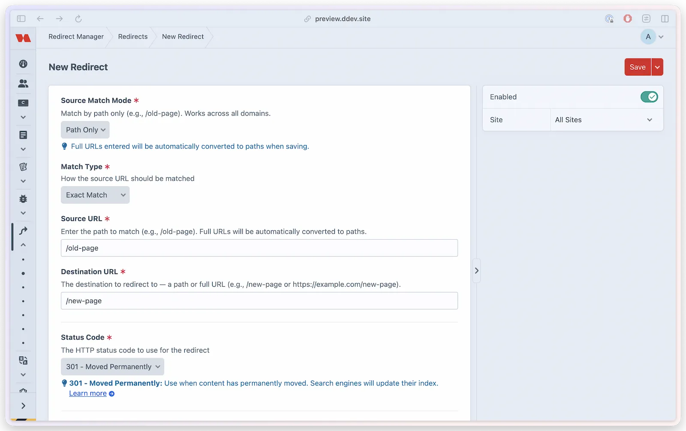

# Quickstart

Get Redirect Manager running in under 5 minutes. By the end of this guide you'll have redirects catching 404s automatically.

## Before you start

Complete [Installation and setup](installation.md#post-install-setup) first. The setup page should show that the IP hash salt is configured before you rely on analytics.

## 1. Create your first redirect

1. Go to **Redirect Manager > Redirects**
2. Click **New Redirect**
3. Set **Source URL** to `/old-page`
4. Set **Destination URL** to `/new-page`
5. Leave **Match Type** as `exact` and **Status Code** as `301`
6. Save

## 2. Test it

Open **Redirect Manager → Settings → Test**, enter `/old-page`, and click **Test URL**. You should see **Match Found!** with `/new-page` as the resolved destination. You can also visit `/old-page` in your browser to confirm the live redirect.

## 3. Enable auto-redirects

Auto-redirect creation is enabled by default. When you change an entry's slug, the plugin automatically creates a redirect from the old URL to the new one.

## What's next

- [Configuration](configuration.md) — tune analytics, caching, query string handling, and backups
- [Testing tools](../resources/testing-tools.md) — validate redirect matches and the JSON API from the Control Panel
- Check **Redirect Manager > Analytics** to monitor 404s across your site
