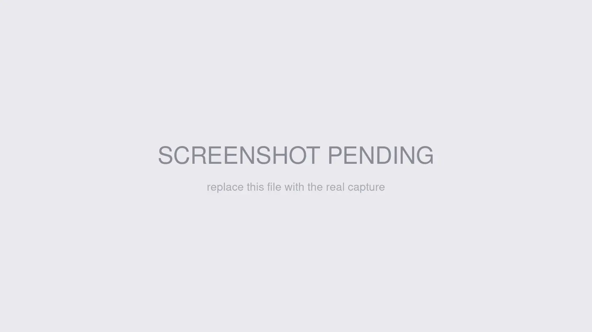

# Testing tools

Use **Redirect Manager → Settings → Test** when you need to confirm what Redirect Manager would do before you visit a URL, change rule priority, or hand the JSON API to another system. The page has two tabs: **Test URL Redirects** for redirect matching and **Test JSON API Endpoint** for the read-only redirects API.

The rule-bearing Test page requires both `redirectManager:manageSettings` and `redirectManager:manageRedirects`. This keeps settings access separate from permission to view redirect rules. The standalone Postman download remains available with `redirectManager:manageSettings`.

## What you'll use it for

- Checking which eligible safe redirect wins for a URL, including site scope, capture substitution, and chain safety
- Seeing lower-priority safe redirects that also match the same URL
- Creating a manual redirect from a no-match result
- Verifying the JSON API is enabled, token-configured, and returning JSON
- Downloading the bundled Postman collection and environment for API testing outside Craft

## Test URL redirects

Open **Redirect Manager → Settings → Test**. The **Test URL Redirects** tab is selected by default.

1. Enter a **Test URL**. You can use a path such as `/old-page` or a full URL such as `https://example.com/old-page`.
2. Click **Test URL**.

The test accepts paths and full URLs. If you enter text without a leading slash or scheme, the page normalizes it for the test: dotted values become `https://...`, and other values become `/...`.

The tester also applies your current query-string settings. With **Strip Query String** enabled, tracking parameters such as `utm_source` and `fbclid` are ignored while matching. With **Preserve Query String** enabled, the same parameters appear on the resolved destination preview after capture substitution. Existing destination parameters remain first, and the incoming query is inserted before any `#fragment`, matching the live redirect response.

When a redirect matches and resolves safely, the result shows **Match Found!**, the source URL, destination URL, resolved destination URL, match type, source match mode, status code, and priority. Site-specific matches appear before global matches; priority and rule ID order matches within each site rank. If more eligible safe redirects also match, they appear under **{count} other redirect(s) also match this URL**. Matches whose captures would cross the destination trust boundary, whose chains cycle, or whose chains exceed the depth limit are omitted, just as they are during a live frontend, GraphQL, or plugin-integration lookup.

When no redirect matches, the result shows **No Match Found** and offers **Create Redirect for This URL**. Full URLs prefill `redirectSrcMatch=fullurl`; paths create a normal path-only redirect draft.

Results include global redirects and redirects assigned to sites the current user can edit. Rules for other sites are not included, even when their source URL also matches.

## Test the JSON API endpoint

Switch to **Test JSON API Endpoint** to call `/actions/redirect-manager/api/get-redirects` from the Control Panel.

The tab reflects the real API requirements:

- If the JSON API is disabled, it shows **The JSON API endpoint is disabled. Enable it in Advanced settings before running endpoint tests.**
- If `REDIRECT_MANAGER_API_TOKEN` is missing, the test action returns the same environment-token warning used elsewhere in settings.
- When the endpoint is enabled and token-configured, the page shows **REDIRECT_MANAGER_API_TOKEN is configured. Endpoint tests will use it automatically.**

Choose a specific editable **Site**, then click **Run API Test**. The tester does not offer an all-sites request or accept a site the current user cannot edit. The result pane shows **Status**, **Time**, **Equivalent curl**, **Response headers**, and **Response body**. The generated curl uses `Accept: application/json` and the placeholder `X-Redirect-Manager-Key: $REDIRECT_MANAGER_API_TOKEN`; the configured token stays server-side and is never returned to the browser.

The CP tester is read-only. It lists enabled redirects through the JSON API and does not create, update, delete, resolve, increment hit counts, or write analytics.

## Download the Postman collection

The API tab includes a **Developer Resources** box with **Download Postman collection**. This placeholder-only download follows the settings permission and does not require redirect-view access. The download is `redirect-manager-postman.zip` and includes:

- `Redirect-Manager.postman_collection.json`
- `Redirect-Manager.postman_environment.json`
- `README.md`

Use it for external endpoint checks, token enforcement, site filtering, Accept-header validation, and rate-limit probes.

## Next steps

- [Redirects](../feature-tour/redirects.md) — understand match types, captures, priority, and status codes.
- [Configuration](../get-started/configuration.md) — enable and token-protect the JSON API.
- [API endpoints](../developers/api-endpoints.md) — see the JSON API contract and status codes.
- [Postman collection](../developers/postman.md) — import the same files downloaded from the Test page.
- [Troubleshooting](troubleshooting.md) — diagnose no-match, API token, and rate-limit issues.
